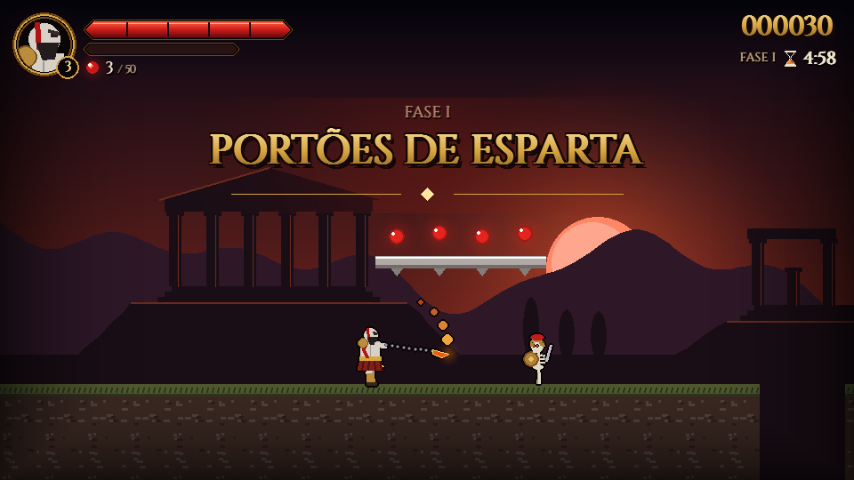

# Blades of Sparta

Jogo de plataforma 2D em **Python + Pygame** inspirado na mitologia grega: um guerreiro
espartano com lâminas acorrentadas enfrenta esqueletos, harpias e o Ciclope Polifemo.

Projeto acadêmico da disciplina **Computação Gráfica e Realidade Virtual**.



## Como rodar

Requer Python 3.10+.

```bash
pip install -r requirements.txt
python main.py
```

### Executável (Windows)

```bash
python tools/gerar_executavel.py
```

Isso gera `dist/BladesOfSparta.exe`, um arquivo único que roda sem Python instalado.

## Controles

| Tecla | Ação |
|---|---|
| A / D ou setas | andar |
| Espaço / W / ↑ / Z | pular (segure para ir mais alto); aperte de novo no ar para o **pulo duplo** |
| S / ↓ | descer de plataforma de uma via |
| J / X | golpe das lâminas (combo de 3) |
| L / Shift | **esquiva**: avanço rápido e invencível |
| K / C | Fúria Espartana (com o medidor cheio) |
| P / Esc | pausar |
| M | voltar ao menu (na pausa, no Game Over e na vitória) |
| F3 | modo depuração (hitboxes e FPS) |

No menu, ↑/↓ escolhe entre **Jogar**, **Controles** e **Sair**, e Enter confirma.

## Recursos

- 3 fases: **Portões de Esparta**, **Cavernas do Hades** e **Arena do Ciclope** (chefe)
- Física com gravidade, pulo variável, pulo duplo, esquiva, *coyote time* e plataformas de uma via e móveis
- Combate com combo de lâminas (com *buffer* de ataque), pisão estilo Mario, empurrão,
  invencibilidade após dano e *hitstop* (pausa curtíssima a cada acerto)
- Vida em segmentos, 3 vidas, orbes (50 = vida extra), checkpoints e tempo limite
- Inimigos com IA: patrulha, arremesso de lanças, voo senoidal com mergulho e chefe com investida e ondas de choque
- Visual "épico sombrio": arte 100% procedural, contorno nos personagens, vinheta, HUD com
  acabamento dourado e fonte Cinzel (opcional, em `assets/fontes`) — sons sintetizados;
  nenhum arquivo externo é obrigatório

## Testes

```bash
python -m unittest discover -s tests
```

São 73 testes sem janela: física, pulo e pulo duplo, esquiva, colisões, combate e combo,
chefe, estados e menu, vidas, limites, regras dos mapas, um bot que completa cada fase e um
teste de fumaça.

## Documentação

O documento do mini-projeto (objetivo, bibliotecas, coordenadas, regras, erros tratados,
casos de teste e esboço da tela) está em [docs/MINI_PROJETO.md](docs/MINI_PROJETO.md).

## Estrutura

```
main.py      ponto de entrada (loop principal)
jogo/        código do jogo
  config.py    constantes (física, combate, pontuação)
  nivel.py     mapas ASCII das fases e grade de tiles
  fisica.py    corpos e colisão eixo a eixo
  heroi.py     o espartano
  inimigos.py  esqueleto, arqueiro, harpia, Ciclope
  objetos.py   orbes, altar, portal, plataformas, projéteis, partículas
  jogo.py      estados, regras e ciclo atualizar/desenhar
  desenho.py   arte procedural
  hud.py       HUD, menu e telas
  camera.py, entrada.py, recursos.py
assets/      arquivos opcionais (fontes/Cinzel.ttf, licença SIL OFL)
tests/       testes automatizados
tools/       captura de telas, bot de percurso e gerador do executável
docs/        documentação e imagens
design/      game brief (Claude Code Game Studios)
production/  evidências de QA (capturas por etapa)
.claude/     agentes e skills do Claude Code Game Studios (licença MIT, ver .claude/LICENSE-CCGS.txt)
```

## Autor

[@Kauhan33](https://github.com/Kauhan33)
