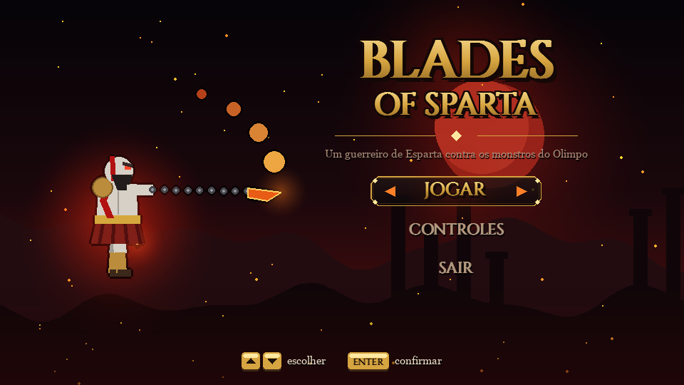
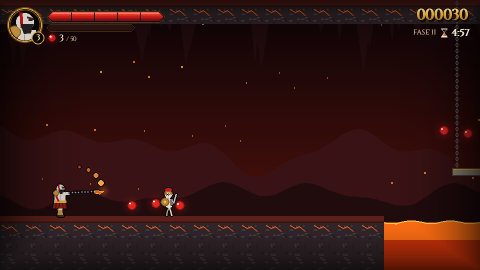
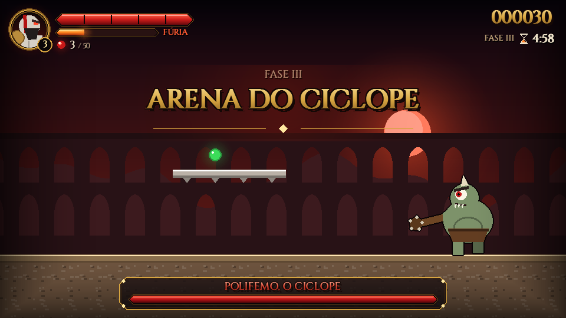
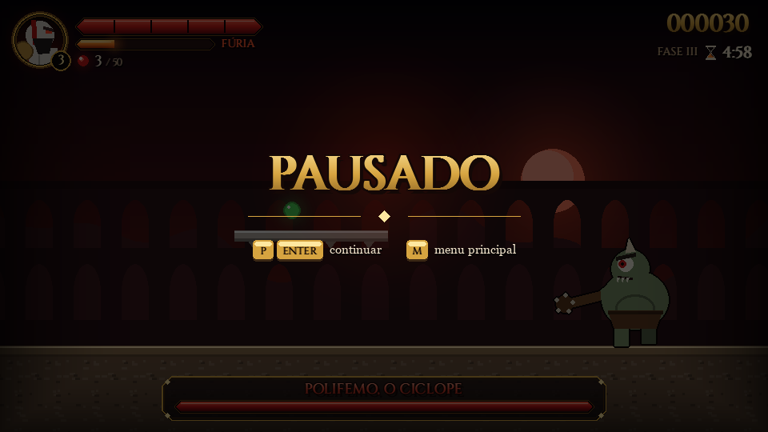
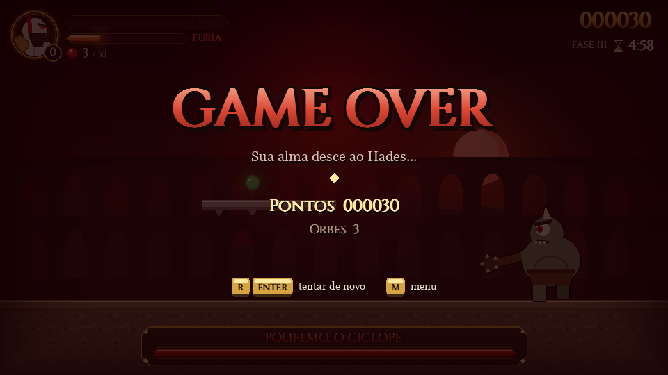
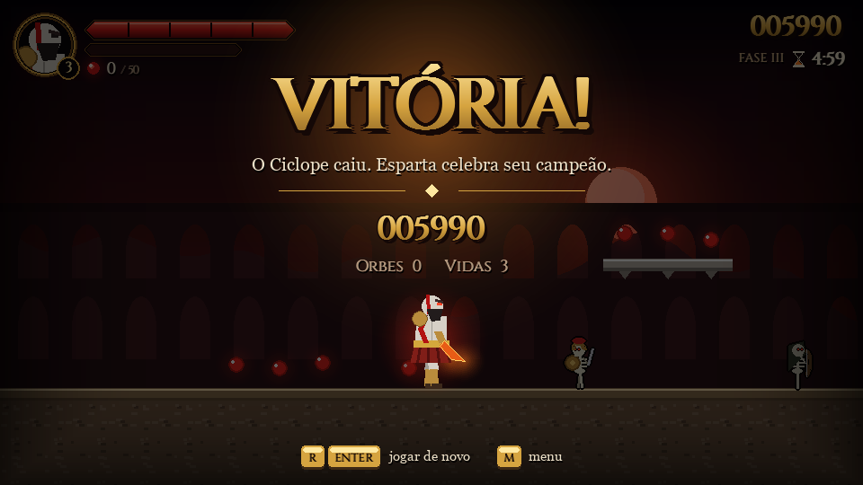

# Mini-projeto — Blades of Sparta

**Disciplina:** Computação Gráfica e Realidade Virtual
**Tema da aula:** Jogos em Python (05/10) — *"projetar antes de programar"*


---

## 1. Nome e objetivo do jogo

**Blades of Sparta** é um jogo de plataforma 2D (estilo Mario) com combate inspirado em
*God of War*. O jogador controla um **guerreiro espartano** armado com **lâminas acorrentadas**
e atravessa três fases da mitologia grega:

| Fase | Cenário | Novidades |
|---|---|---|
| 1 — Portões de Esparta | campo com templos ao pôr do sol | esqueletos, arqueiro, harpia, fossos, espinhos, checkpoint |
| 2 — Cavernas do Hades | caverna com teto e lava | lava, plataformas móveis acorrentadas, mais arqueiros e harpias |
| 3 — Arena do Ciclope | coliseu | luta contra o chefe **Polifemo, o Ciclope** |

**Objetivo:** chegar ao portal no fim de cada fase. Na última, o portal só abre depois que o
Ciclope é derrotado. No caminho, o jogador coleta orbes vermelhos (pontos e vidas extras),
quebra ânforas e derrota inimigos.

> Os personagens são **originais e apenas inspirados** no estilo da série (guerreiro careca,
> pele cinzenta, tatuagem vermelha, lâminas incandescentes). O jogo não usa nomes, imagens
> ou marcas da franquia.

## 2. Bibliotecas Python

| Biblioteca | Uso no projeto |
|---|---|
| `pygame` | janela, teclado, retângulos (`Rect`) e colisão, desenho de formas, fontes, áudio, controle de FPS |
| `random` | velocidade dos esqueletos, recarga dos arqueiros, orbes soltos pelas ânforas, partículas, tremor da câmera |
| `math` | `sin` na flutuação dos orbes e no voo da harpia, `atan2`/`cos`/`sin` no mergulho da harpia, `hypot` para distâncias, ângulos dos golpes das lâminas |
| `enum`, `dataclasses`, `array` | estados do jogo (`Estado`), objeto `Entrada` e síntese dos efeitos sonoros (biblioteca padrão) |

Não há imagens nem sons obrigatórios: **toda a arte é desenhada com primitivas do pygame** e os
sons são sintetizados em tempo de execução.

```python
import pygame
import random
import math

pygame.init()
```

## 3. Objetos gráficos e suas coordenadas

**Sistema de coordenadas:** origem (0, 0) no canto superior esquerdo do mapa, **x cresce para a
direita e y cresce para baixo** (padrão do pygame). Cada fase é um mapa ASCII com 11 linhas, e
cada caractere é um tile de **48 × 48 px**. Logo, o tile da coluna `c` e linha `l` ocupa o
retângulo `(c·48, l·48, 48, 48)`.

A tela tem **960 × 540 px**. A **câmera** converte o mundo para a tela: `x_tela = x_mundo − câmera.x`.

| Objeto | Tamanho (px) | Posição inicial | Representação |
|---|---|---|---|
| Herói (espartano) | 30 × 62 | tile `P` — pés no topo do chão | `Corpo` com `x, y` (float), `vx, vy` |
| Esqueleto legionário `S` | 34 × 50 | centralizado no tile, pés na base | patrulha horizontal |
| Esqueleto arqueiro `A` | 34 × 50 | idem | parado, arremessa lanças (30 × 6) |
| Harpia `H` | 40 × 34 | tile `H` (voa) | trajetória senoidal + mergulho |
| Ciclope `C` (chefe) | 84 × 120 | tile `C` | máquina de estados própria |
| Orbe vermelho `o` / verde `g` | raio 9 / 11 | centro do tile | círculo com brilho |
| Ânfora `X` | 48 × 48 | tile | sólida e quebrável |
| Altar/checkpoint `K` | 32 × 34 | tile | acende ao ser tocado |
| Portal `F` | 72 × 110 | apoiado no chão do tile | arco de mármore |
| Plataforma móvel `M` | 96 × 16 | tile `M`, percorre 192 px | vai e volta |
| Tiles fixos | 48 × 48 | grade | `#` chão, `=` bloco, `-` uma via, `^` espinhos, `~` lava |

Trecho real da fase 1 (`jogo/nivel.py`):

```
         oooo              oooo              oooo
         ----              ====              ----
                                   oo
  P  ooo      S         X      S  ####        ^^    K   S  A
##################  ##################   ####################
```

## 4. Regras de movimentação

Todo movimento usa **delta-time** (`dt`, em segundos), então a velocidade não depende do FPS:

```
nova_posição = posição_atual + velocidade × dt
velocidade_y = min(velocidade_y + GRAVIDADE × dt, VEL_MAX_QUEDA)
```

| Regra | Valor (`jogo/config.py`) |
|---|---|
| Gravidade | 2200 px/s² |
| Velocidade máxima de queda | 1100 px/s |
| Andar | 300 px/s, com aceleração de 2600 px/s² no chão e 1500 px/s² no ar |
| Pulo | impulso de 800 px/s para cima: ≈ 139 px de altura a 60 FPS (o limite contínuo v²/2g dá 145 px; a integração por quadro perde um pouco) |
| Pulo variável | soltar o botão na subida corta a velocidade pela metade |
| **Pulo duplo** | no ar, mais **1** pulo de 680 px/s; recarrega ao tocar o chão ou pisar num inimigo. Os dois juntos sobem ≈ 5 tiles |
| **Sem pulo infinito** | do chão, só pula se tocou o chão há no máximo 0,10 s (*coyote time*); no ar, só o pulo extra que sobrou |
| Esquiva | `L`/`Shift`: 0,18 s a 640 px/s, sem gravidade e **invencível**; recarga de 0,6 s e só uma no ar até pousar |
| Buffer de pulo | um aperto até 0,12 s antes de pousar ainda vale |
| Plataforma de uma via | atravessa de baixo para cima; `S`/↓ desce por ela |
| Plataforma móvel | carrega o herói junto (soma o deslocamento dela ao dele) |
| Câmera | segue o herói com interpolação (`câmera += (alvo − câmera) × 7·dt`), limitada às bordas do mapa |
| Animação | pernas e braços oscilam com `sin(tempo × 14)` enquanto corre (troca de "frames" procedural) |

**Inimigos:** o esqueleto anda e vira ao encontrar parede ou beirada. O arqueiro mira no herói e
arremessa a cada 1,6–2,4 s. A harpia voa em `x = base + 120·sin(0,9t)` e
`y = base + 14·sin(3t)` e mergulha na direção do herói calculada com `atan2`. O Ciclope (20 de
vida) alterna **andar → preparar → investida** e **andar → preparar → salto** (ao pousar, solta duas
ondas de choque). O aviso ("preparar") dura 0,65 s e muda conforme o ataque: para a investida ele
ergue a clava e ruge; para o salto ele se agacha. Fica atordoado ao bater na parede (1,4 s), depois
do salto (0,9 s) ou quando a investida termina sem acertar (0,6 s). Com metade da vida fica furioso:
35% mais rápido e com menos tempo entre ataques. Todos esses valores estão em `jogo/config.py`.

## 5. Regras de colisão

**Como o computador sabe que o personagem está em cima do chão?** A colisão é resolvida **um eixo
por vez** (`jogo/fisica.py`):

1. Move em **X**. Se o retângulo entrou num tile sólido, é empurrado para fora (encosta na parede).
2. Move em **Y**. Se estava caindo e a base entrou num tile sólido, a base é colocada exatamente
   no topo do tile, `vy = 0` e **`no_chao = True`**. Se estava subindo, bate a cabeça no teto.
3. Plataformas de uma via e móveis só seguram quem vinha de **cima** (a base no quadro anterior
   estava acima do topo delas).

| Colisão | Resultado |
|---|---|
| Herói × tile sólido | bloqueia o movimento (chão, parede, teto) |
| Herói × espinhos `^` | −1 de vida e quique para cima |
| Herói × lava `~` ou queda no abismo | perde uma vida (depois de 1,4 s de animação de morte) |
| Herói × inimigo (lado) | −1 de vida (−2 do Ciclope), empurrão e **1,2 s de invencibilidade** (pisca) |
| Herói **caindo** sobre o inimigo | **pisão** estilo Mario: inimigo leva 1 de dano e o herói quica (no Ciclope só quica). Vale se, no quadro anterior, a base do herói estava acima do topo do inimigo; o herói é encostado no topo antes do quique para não sair machucado |
| Lâminas × inimigo | dano de 1 (2 no 3º golpe do combo; dobra na Fúria) e empurrão; cada golpe acerta cada inimigo só uma vez |
| Lâminas × lança | a lança é destruída |
| Lança ou onda de choque × herói | −1 de vida e empurrão |
| Herói × Ciclope em investida | −2 de vida e a investida termina (um ataque, um acerto) |
| Herói **esquivando** × qualquer dano | ignorado (lava e abismo continuam matando) |
| Lâminas × ânfora | quebra e solta 3 orbes (+50 pontos) |
| Herói × orbe | vermelho: +1 orbe e +10 pontos (a cada 50 orbes, +1 vida); verde: +2 de vida |
| Herói × altar | vira o ponto de renascimento |
| Herói × portal | conclui a fase (se não estiver trancado) |
| Projétil × parede / fim do tempo | projétil removido |

**Combate:** `J`/`X` faz um combo de 3 golpes (corte, corte para cima e giro de 360° que acerta os
dois lados). O combo continua se o próximo golpe vier em até 0,6 s, e um aperto feito até 0,15 s
antes do fim do golpe fica guardado (*buffer*), então apertar no ritmo encadeia os 3. Cada acerto
congela o mundo por 0,05 s (*hitstop*; 0,09 s no 3º golpe) e enche o medidor de **Fúria Espartana**
(+12). Com ele cheio, `K`/`C` ativa 6 s de dano dobrado.

## 6. Condições de vitória e Game Over

- **Vida:** 5 segmentos. Chegou a 0 → perde uma vida.
- **Vidas:** começa com 3. Perde uma vida ao zerar a vida, cair em fosso, tocar lava ou esgotar o
  tempo (300 s por fase). Renasce no último altar com vida cheia. O relógio só volta a 300 s
  quando a morte foi por tempo esgotado; nas outras mortes ele continua de onde parou. Se morrer
  durante a luta, o Ciclope também é reiniciado.
- **Game Over:** vidas = 0. Mostra a pontuação, e `R`/`Enter` recomeça.
- **Fase concluída:** tocar o portal. Bônus de 1000 pontos + 10 pontos por segundo restante.
- **Vitória:** tocar o portal da fase 3, que só destranca com o **Ciclope derrotado**.

Os estados formam uma máquina de estados com transições permitidas
(`MENU → JOGANDO ↔ PAUSADO`, `JOGANDO → FASE_CONCLUIDA / GAME_OVER / VITORIA`...). Qualquer
transição fora da tabela é recusada, então **"vivo e Game Over ao mesmo tempo" é impossível**.

## 7. Erros tratados

Os seis riscos do slide *"Tratamento de erros"* foram tratados:

| Erro | Tratamento | Onde |
|---|---|---|
| **Arquivo não encontrado** (imagem/áudio/fonte) | `try/except` devolve um substituto (superfície colorida, som sintetizado, fonte do sistema) e avisa uma vez no console. Na prática: a fonte dos títulos é carregada de `assets/fontes/Cinzel.ttf`; apague o arquivo e o jogo continua com a fonte do sistema | `jogo/recursos.py` |
| **Entrada inesperada** (teclas simultâneas) | esquerda + direita juntas se anulam (eixo = direita − esquerda); comandos são lidos num objeto `Entrada` | `jogo/heroi.py`, `jogo/entrada.py` |
| **Objeto fora da tela** | laterais do mapa são paredes; câmera limitada às bordas; queda abaixo do mapa = perder vida; inimigos que caem são removidos | `jogo/nivel.py`, `jogo/camera.py` |
| **Lista crescendo** | projéteis, partículas, textos, orbes e inimigos mortos são removidos a cada quadro; partículas têm teto de 400 | `jogo/jogo.py` |
| **Estado impossível** | `Enum` + tabela `TRANSICOES`; vidas nunca negativas | `jogo/jogo.py` |
| **FPS instável** | movimento por `dt` e `dt` limitado a 1/30 s, para não atravessar paredes num travamento | `jogo/config.py`, `Jogo.atualizar` |

Além disso, o mapa é validado ao carregar (larguras iguais, exatamente um `P`, pelo menos um `F`,
sem caracteres desconhecidos), e uma falha ao abrir a janela é mostrada com uma mensagem clara.

## 8. Casos de teste

São **73 testes automatizados** (`python -m unittest discover -s tests`), rodando sem janela.
Exemplos por categoria do slide *"Teste como desenvolvedor"*:

| Tipo | Caso de teste | Resultado esperado |
|---|---|---|
| **Limite** | segurar ← encostado na borda esquerda por 2 s | herói continua em `x ≥ 0` |
| **Limite** | chamar `atualizar` com `dt = 5 s` (travamento) | herói não atravessa o chão |
| **Limite** | coletar exatamente 50 orbes | ganha 1 vida extra |
| **Limite** | somar os orbes dos 3 mapas | dá pelo menos 50 (a vida extra é alcançável) |
| **Limite** | maior campo de espinhos | no máximo 3 tiles (dá para pular sem dano) |
| **Limite** | dano maior que a vida | vida = 0 (nunca negativa) e herói morto |
| **Colisão** | cair sobre o chão | `no_chao = True` e base exatamente no topo do tile |
| **Colisão** | pular por baixo de plataforma de uma via | atravessa e pousa em cima; com ↓ desce |
| **Colisão** | dois golpes no esqueleto | esqueleto removido da lista e +100 pontos |
| **Colisão** | cair em cima do esqueleto | esqueleto perde 1 de vida e o herói quica |
| **Colisão** | pisar no esqueleto de 30 alturas diferentes, segurando ou não o pulo | o herói nunca perde vida |
| **Colisão** | cair encostando na lateral do inimigo | é dano, não pisão |
| **Colisão** | dois danos seguidos | só o primeiro vale (invencibilidade) |
| **Estado** | apertar pulo no ar duas vezes | só o 1º vale (pulo duplo); o 3º pulo não existe |
| **Estado** | pulo + pulo duplo embaixo de uma plataforma a 3 tiles | pousa em cima dela |
| **Estado** | esquivar, esquivar de novo logo em seguida | a 2ª só sai depois da recarga; no ar, só uma até pousar |
| **Colisão** | receber dano durante a esquiva | ignorado |
| **Estado** | apertar ataque um pouco antes do fim do golpe | o golpe seguinte do combo sai (buffer) |
| **Estado** | investida do Ciclope que não acerta nada | ele fica atordoado |
| **Colisão** | investida do Ciclope acerta o herói | só 1 acerto por investida |
| **Estado** | menu: ↓, Enter, Enter, ↑, ↑, Enter | abre e fecha os controles; "Sair" encerra |
| **Limite** | distância entre altares, início e portal | no máximo 60 colunas em cada fase |
| **Estado** | morrer no abismo com 120 s no relógio | renasce sem ganhar tempo de volta |
| **Estado** | perder a última vida | `GAME_OVER`, vidas = 0, e a partida para |
| **Estado** | pausar | tempo e posição congelam |
| **Estado** | portal com o chefe vivo | trancado; com o chefe morto → `VITORIA` |
| **Estado** | transição `MENU → VITORIA` | recusada |
| **Percurso** | bot de QA atravessa cada fase (sem inimigos) | as 3 fases são concluídas, provando que todos os pulos são possíveis |
| **Fumaça** | 900 quadros por fase com entradas variadas, desenhando a tela | nenhum erro |

**Um bug que ninguém pensou?** O teste de "dt enorme" simula o jogo travando por 5 segundos: sem o
limite de `dt`, o herói cairia 5 500 px num único quadro e atravessaria o chão.

Outro achado real da revisão de QA: o **pisão machucava o próprio herói**. No quadro seguinte ao
quique ele ainda estava 1–2 px dentro do inimigo, já subindo (`vy < 0`), e o contato contava como
dano em 112 de 200 alturas de queda. O teste que varre as alturas falhou primeiro e passou depois da
correção (o herói é encostado no topo do inimigo, e o pisão é decidido pela posição do quadro anterior).

## 9. Esboço da tela

```
┌────────────────────────────────────────────────────────────────────────┐
│  ╭─────╮ ◢▮▮▮▮▮◣  vida (5 segmentos)                     000000  pontos│
│  │rosto│ ◢▬▬▬▬◣    fúria                       FASE I ⧗ 4:58  tempo    │
│  ╰─(3)─╯ ● 12 / 50 orbes até a vida extra                              │
│   vidas                                                                │
│        (céu escuro com horizonte em brasa; templos em platôs)          │
│                        ● ● ● ●                                         │
│                        ═══════         harpia ~                        │
│      ESPARTANO ⟿⟿ lâmina          esqueleto        altar     PORTAL    │
│ ███████████████████████████   ████████████████████████████████████████ │
│ ███████████████████████████   ████████████████████████████████████████ │
│                       (fosso)       [barra do chefe na fase 3]         │
└────────────────────────────────────────────────────────────────────────┘
```

| Menu | Fase 2 — Hades | Fase 3 — Chefe |
|---|---|---|
|  |  |  |

| Pausa | Game Over | Vitória |
|---|---|---|
|  |  |  |

---

## Conexão com os conceitos da aula

| Pergunta da aula | Resposta no projeto |
|---|---|
| O que transforma um desenho em um jogo? | o loop `Entrada → Regras → Atualização → Renderização`, em `main.py` |
| Como representar a gravidade? | `vy += GRAVIDADE × dt`, com velocidade máxima de queda |
| Como impedir pulos infinitos? | do chão, só com `no_chao` recente (coyote time de 0,1 s); no ar, um contador de pulos extras (1) que só recarrega ao pousar |
| Como detectar chão, parede e inimigo? | colisão eixo a eixo com a grade de tiles + `Rect.colliderect` |
| Como trocar frames para simular corrida? | ângulos de pernas e braços com `sin(tempo)` a cada quadro |
| Como a câmera acompanha o personagem? | interpolação até o herói, limitada às bordas do mapa |
| Como definir vidas, vitória e derrota? | seção 6 + máquina de estados |
| Como controlar FPS e tempo? | `Clock.tick(60)` + delta-time limitado |
| Quando criar e destruir objetos? | criados a partir do mapa ao carregar a fase; destruídos ao morrer, expirar ou ser coletados |

## Como executar

```bash
pip install -r requirements.txt
python main.py
```

Ferramentas: `python tools/capturar_telas.py` gera as imagens deste documento, e
`python tools/bot_percurso.py` roda o bot que atravessa as fases.
